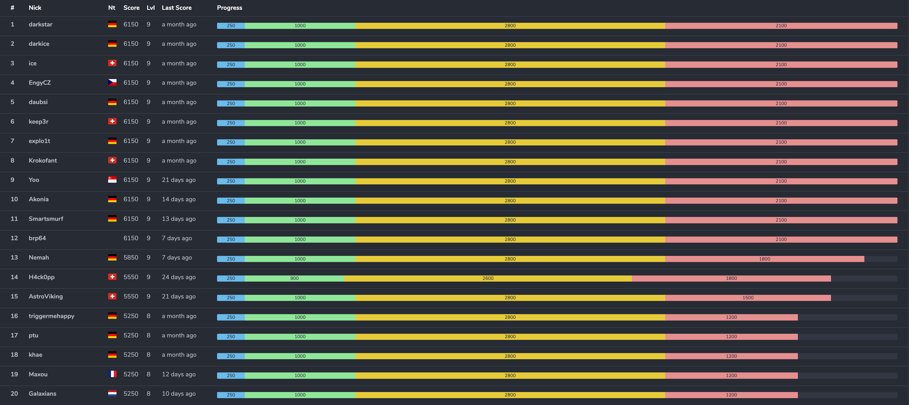
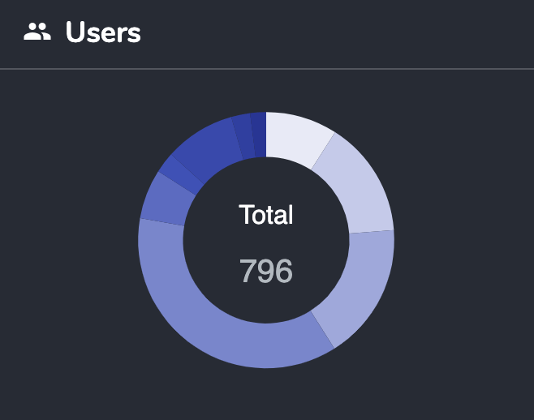
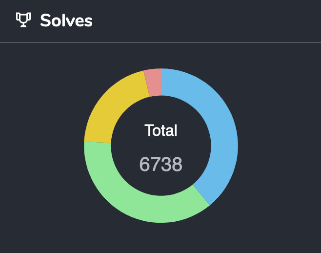

The public GitHub repo for Hacky Easter 2023 is live! Challenge sources, stats, write-ups, and more! 

# HackyEaster 2023

## Thank You
First, a big thank you to the volunteers (otaku, ice, daubsi, khae), and all supporters that bought one or more [Ko-Fi](https://ko-fi.com/hackyeaster)!

## Challenges
You can find all challenges, including sources, dockerfiles, solution, etc. in the challenges/ folder.

## Write-Ups
The following write-ups have been written (contact me at hackyeaster@gmail.com if you want yours to be added). In alphabetical order:

- [atcasanova](https://github.com/atcasanova/hackyeaster2023)
- [bcluyse](https://github.com/bcluyse/he2023-writeup)
- [brp64 (GitHub)](https://github.com/tbrup/ctf-writeups/blob/main/HackyEaster/he2023/solution.pdf)
- [daubsi (GitHub)](https://github.com/OevreFlataeker/hackyeaster2023_writeup)
- [Ho3rnch3n (HGitHub)](https://github.com/Ho3rnch3n/hackyeaster2023)
- [Galaxians](https://shiltemann.github.io/CTF-writeups-public/writeups/HackyEaster_2023/)
- [Maxou (GitHub)](https://github.com/paul-maxime/ctf-writeups/tree/main/hackyeaster2023)
- [Neighborkid01 (GitHub)](https://github.com/Neighborkid01/hacky_easter_2023)

## Ph1n1sh3rs
The following players have beaten all levels and got rewarded with a "Ph1n1sh3r" badge. Congrats!

darkstar, darkice, ice, EngyCZ, daubsi, keep3r, explo1t, Krokofant, Yoo, Akonia, Smartsmurf, brp64, Nemah, H4ck0pp, AstroViking, Robbe7730

## Perfect solvers
The following Ph1n1shers also managed to solve **all** challenges.

darkstar, darkice, ice, EngyCZ, daubsi, keep3r, explo1t, Krokofant, Yoo, Akonia, Smartsmurf, brp64

## Survey Results
[Hacky Easter 2023 Survey Results.pdf](docs/Hacky%20Easter%202023%20Survey%20Results.pdf "Survey Results PDF")

## Top 20

## Stats
### Players
| players | count |
| :- | -: |
| ph1n1sh3r (level 9) | 16 |
| level 8 | 19 |
| level 7 | 71 |
| level 6 | 21 |
| level 5 | 50 |
| level 4 | 292 |
| level 3 | 138 |
| level 2 | 117 |
| level 1 | 72 |
| **total** | 796 |

### Solves
| solves | count |
| :- | -: |
| noob | 2633 |
| easy | 2477 |
| medium | 1382 |
| hard | 246 |
| **total** | 6738 |

